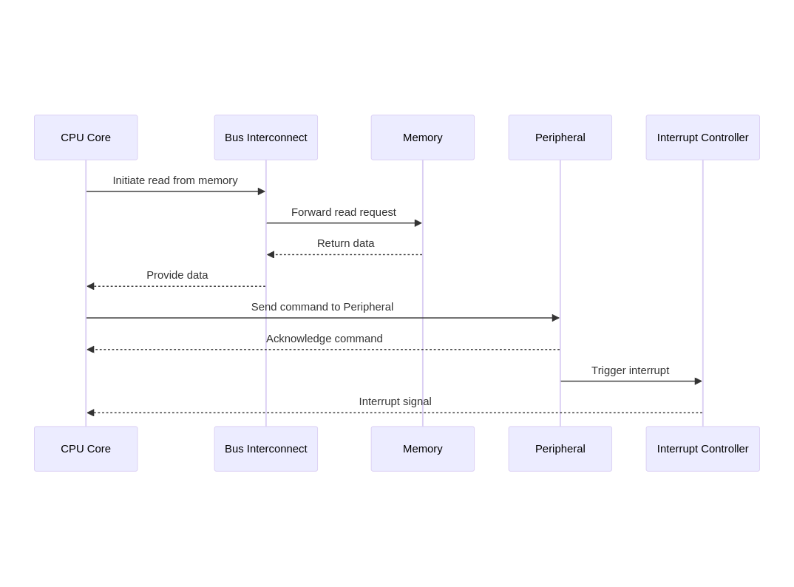

Architecture
============

Scheduling messages on a peripheral bus like Controller Area Network (CAN) is analogous to scheduling tasks by fixed priorities. We therefore take a brief detour into communication inside a SOC for transactions happening with a single processor.

## Sequence Diagram for transactions inside a SOC

- CPU Core initiates a read operation through the Bus Interconnect to the Memory.
- Memory responds with the requested data back to the CPU Core through the Bus Interconnect.
- CPU Core sends a command to a Peripheral.
- Peripheral acknowledges the command back to the CPU Core.
- Peripheral triggers an interrupt to the Interrupt Controller.
- Interrupt Controller sends an interrupt signal to the CPU Core.

## Modification to Litex for Real Time Systems

1. We propose to replace the interrupt controller for Vexriscv in Litex with an implementation of the RISC-V [CLIC](https://github.com/riscv/riscv-fast-interrupt/blob/master/clic.adoc) specifciation, which provides the core with key features such as prioritization by level and priority, selective hardware vectoring, and non-nested interrupt optimization (tail-chaining through the `xnxti` CSR) directly as RISC-V standard extension.

2. We propose early mret (emret), a novel instruction that further optimizes tail-chaining compared to the baseline strategy proposed in the CLIC standard (i.e., `xnxti`) and its enhancement from `jalxnxti` CSR. 

3. We propose to use the background saving mechanism to accelerate the state saving and restoring part of context switches by interleaving the loading of a new state with the automatic saving hardware pushing out the previous register state to memory in the background. 

## Proposed Plan

Detailed roadmap for the proposal can be found at [Roadmap](./Roadmap.md).
