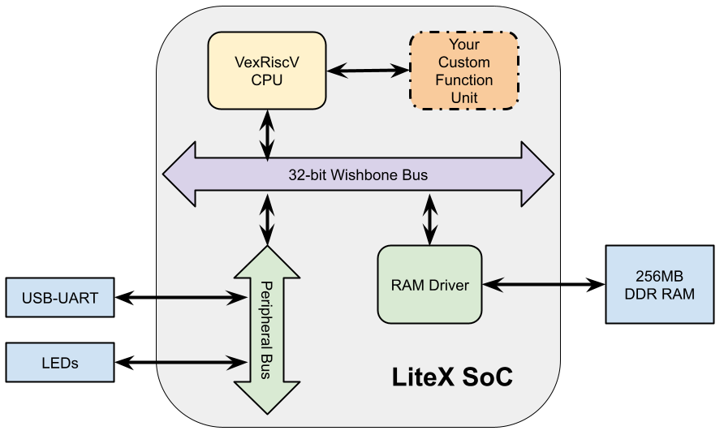

# Litex SOC with Custom Function Unit

We use the Litex framework to demonstrate how to design Custom Functions to extending an FPGA-based RISC-V core in a way that it can fully support Real Time system requirements.

